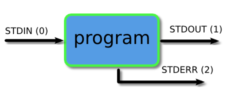
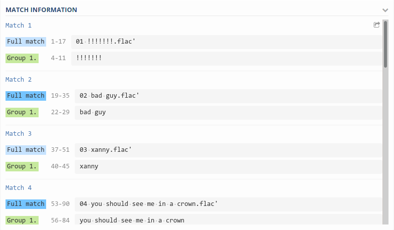

# Introduction to bash


## Preamble

### Shell, terminal and console

The **shell** is the program which actually processes commands and returns output, e.g., Bash, zsh, etc... 

A **terminal** refers to a wrapper program which runs a shell.

The **console** is a special sort of terminal (low level).

Reference: https://superuser.com/questions/144666/what-is-the-difference-between-shell-console-and-terminal

### Prompt

As you already know bash prompt is a `$` sign when you are a standard user. When you are an administrator (often called `root` user) the prompt is a `#`.

## The Unix directory structure

Many details on the Unix directory structure at <https://www.howtogeek.com/117435/htg-explains-the-linux-directory-structure-explained/>

Some aliases:

- `~` is an alias to your home directory.
- `.` is an alias to the current directory.
- `..` is an alias to the parent directory.

For instance

```bash
$ cd ~
$ pwd
$ cd ../../home/../etc/../home/
$ pwd
```

----
### <font color='red'>Exercise:</font>

   1. What is the difference between `cd ./toto/tata`, `cd toto/tata` `cd ~/toto/tata` and `cd /toto/tata`
   2. Use the `locate` command to determine if `matlab` is installed on your system
   3. Use the `which` command to determine which instance of python is used when you use the `python` command. Same question with `python2`.
----

## Getting help

To get some help for a command, please use the `man` command. You may also use the `--help` option as in

```bash
$ man ls
$ ls --help
```

## Paging programs

A paging program displays, one windowful at a time, the contents of a file on a terminal.
It pauses after each windowful and prints on the window status line the screen the file name, current line number, and the percentage of the file so far displayed.
This is not an editor (no modification of the file can be done)

`more` (deprecated) `less` (best choice) `most` (default on your machine, more feature than `less`, but bad keybindings).

```bash
$ man less
$ man most
```

**Useful tips:**

- to search for a word type `/`. To go to the next (resp. previous)  occurrence type `n` (resp. `p`).
- [less only] to go down type `j`, to go up type `k`.
- to go to the beginning of file type `g`, to the end `G`.
- To quit type `q`.
- to change the default paging program to `less`.

   ```bash
   $ export MANPAGER=less
   ```

More resources: <https://unix.stackexchange.com/questions/81129/what-are-the-differences-between-most-more-and-less>

## Pattern matching (part I): Pathname expansion (a.k.a. globbing)

It is often very useful to select some files which filename contains (or not!) a specific pattern. Shells (bash, zsh, etc...) comes with a "pattern matching" syntax allowing us to express such constraints on the filenames. 

This syntax is commonly called `globs` and is quite simple (more advance syntaxes called `regexp` will be introduced later on). `globs` are **shell commands** and can be transmitted to various program (`ls`, `grep`, `find`, etc...). For instance to display all the files with an extension in `.txt` in the current directory:

```bash
$ ls *.txt
```

Most shells have similar glob rules, and they usually consist of:

   - A marker for zero-or-more characters: `*`
   - A marker for exactly one character: `?`
   - A way to express one of a certain set of characters: `[...]`
   - A way to express a choice of one or more strings: `{...,...}`
   - A way to escape any of the above special characters: `\`


----
### <font color='red'>Exercise:</font>

   1. Go to `/usr/lib/R/bin/` and list every file starting with a letter `R` and containing `i`
   2. Go to `/usr/lib/R/bin/` and list every file containing the letter `c`, then any character, and then a `n` (e.g. `config` or `javareconf`)
   3. Got to `/var/log/` and list every files with a double extension: the former one is a dot followed by a number, the last one is `.log` (e.g. `Xorg.3.log` or  `Xorg.0.log`)
   4. Got to `/var/log/` and list every files with a name starting with a `a` and containing at least a digit
----

## Listing files

To list the files in a folder use the command `ls`.

----
### <font color='red'>Exercise:</font>

   1. describe the option `-a`.
   2. describe the option `-R`.
   3. describe the option `-lh`.
   4. List all the files in the directory `/usr/lib/` without `cd` in it.
----

The `file` command can be used to display the information of a file (if not given by the extension itself).

----
### <font color='red'>Exercise:</font>

1. List all the files in the directory `/usr/lib/R/bin` and sort them by size.
2. Display the type information of the files in `/var/log/` one call to `file`.
----

## Symbolic links

A symbolic link or **symlink** is a special file containing a reference (a link) to another file or directory. For instance try

```bash
$ ls -l /usr/bin
```

A symlink can be created with the command `ln`.

```bash
$ ln -s target_path link_path
```

----
### <font color='red'>Exercise:</font>

1. Create a symlink called `my_python` pointing to `/usr/bin/python` in your `home` directory.
----

## Users

To list the groups you belong to, in a terminal use the command

```bash
$ groups
```

To list the connected user on your machine

```bash
$ w
$ who
```

## File permissions

Each file has an **owner** (a user) and a **group** (a group of users). To change the user that owns use `chown` and to change the group use `chgrp`. There are 3 types of permissions:

1. read  `r`
2. write `w`
3. execute `x`

There are three permissions triads

1. first triad: what the user can do (letter `u`)
2. second triad: what the group members can do (letter `g`)
3. third triad: what other users can do (letter `o`)

Each triad

1. first character `r`: readable
2. second character `w`: writable
3. third character `x`: executable

To change the permissions of file, use the `chmod`. For instance, to add execution `x` right to the owner `u`:

```bash
$ chmod u+x toto.txt
```

----
### <font color='red'>Exercise:</font>

   1. Create an empty file called `foo.py` in the current directory
   2. Display its owner, group and permissions
   3. Change the group of `foo.py` to `pulse`
   4. Add read and write permissions to user in the group `pulse`
----

Ref: <https://en.wikipedia.org/wiki/File_system_permissions>. See also `chown` and `chgrp`

## Environment variables

An environment variable (in short env or envs) is a dynamic-named value that can affect the way running processes will behave on a computer.
Many options of bash may be change with envs.
To print all the defined envs:

```bash
$ printenv
```

To display a single variable, you may use the prefix `$`. For instance, to display the content of `PATH`

```bash
$ echo ${PATH}
```

To set a new variable (in bash)

```bash
$ export ENV_NAME=toto:tata
```

List are often separated by `:`. To append a new value at the end

```bash
$ export ENV_NAME=${ENV_NAME}:tutu
$ echo ${ENV_NAME}
```

Some documentation: <https://www.digitalocean.com/community/tutorials/how-to-read-and-set-environmental-and-shell-variables-on-a-linux-vps>

----
### <font color='red'>Exercise:</font>

   1. Display the PATH env
   2. Is the order of the list important?
----

**Useful tips:**

   - To avoid setting up an env every time you open a terminal, you can append the `export MYENV=xxxxx` command to the `~/.bashrc` file.


### Text editor

In bash, many configuration files are in fact **text file**. You may need to choose a text editor to modify them.
Very powerful (and thus complicated) text editors exist: `emacs`, `vim`, but we will focus on `nano` (`gedit` is another alternative):

```bash
$ nano
```

or `joe` (default on your system).

----
### <font color='red'>Exercise:</font>

   1. Set `nano` as your default text editor
----

### Useful `unix` commands

- list files and get informations: `ls`, `file`, `find`
- display text content: `echo`, `cat`, `head`, `tail`, `grep`, `fgrep`, `rgrep`
- file handling: `touch`, `mv`, `cp`, `rsync`, `rename`
- unix admin: `which`, `who`, `top`, `htop`, `kill`, `pkill`, `killall`


## System

### Getting system information

To display the system information

```bash
$ uname -a
```

To show the system hostname you may use `hostname` command.

To show information about your processor use `lscpu` and to list the devices connected to your machine use `lspci`.

----
### <font color='red'>Exercise:</font>

   1. Determine how many physical core you have on your machine.
   2. Determine the vendor of the network card of your machine.
----

### Process

Learn how to use `ps`, `top`, `htop`, `kill`, `pkill`, ... reading <https://www.tutorialspoint.com/unix/unix-processes.htm>

----
### <font color='red'>Exercise:</font>

   1. Describe the effect of `Ctrl+C` in a terminal
   2. Describe the effect of `Ctrl+Z` in a terminal
   3. Describe the effect of `Ctrl+D` in a terminal
----

## Display text content

### Get the data

The dataset we are going to use is available at <https://www.data.gouv.fr/fr/datasets/accidents-de-velo-en-france/>. We will focus on bicycles accident in France from 2005-2017.

----
### <font color='red'>Exercise:</font>

   1. Create a folder `data_bicycle` and `cd` to it.
   2. Download the `.csv` file available at the following URL: <https://koumoul.com/s/data-fair/api/v1/datasets/accidents-velos/raw> as `bicycle_db.csv` (use the option `-O` of  `wget` or redirect the output of `curl` with `-o` operator described below). Details (in French) on the dataset are available here: <https://www.data.gouv.fr/fr/datasets/accidents-de-velo/>
----

### Text commands: `tail`, `head`, `cat`, `wc` and `split`

Please read the manual of `tail`, `head`, `cat`, `wc` and `split`

----
### <font color='red'>Exercise:</font>

   1. Use the word count `wc` command to display the number of lines of `bicycle_db.csv`
   2. Display the 53 first line with the `head` command. Same with the 30 last lines (see `tail`)
   3. Use the `split` command and its options `-d` `-l` and `--additional-suffix` to create files with a maximum number of lines of 10000 (e.g. :if the number of lines is 55379, you should get only 6 files with names `bike00.csv`, ..., `bike05.csv`)
----

### The `grep` command

`grep` prints lines of a file matching a pattern (regex).

```bash
$ man grep
```

----
### <font color='red'>Exercise:</font>

   1. Count the number of accident in 2005 using the command `grep` (hint: remark that each line **starts** with the string `"YYYY` where `YYYY` is the year)
   2. Display the line number of the accident occurring on a Wednesday, in October 2017 using a regular expression.
----

### The `find` command

The `find` command search for files in a directory hierarchy. Read the manual. For instance:

```bash
$ find /usr/lib/ -name "*qt5*" -type f
```

list all the **files** in `/usr/lib/` containing the `qt5` string in its name.

----
### <font color='red'>Exercise:</font>

   1. What is the aim of the `-exec` option?
   2. Change the permissions of any file with extension `.csv` in your `home` to `777`
----

Reference: <https://www.tecmint.com/35-practical-examples-of-linux-find-command/>

### The `args` command

TODO

## Pipes and redirections



The I/O of any program launch through the bash are organized in three data streams:

- STDIN (0): standard input (input)
- STDOUT (1): standard output (data output by the command and printed in the terminal)
- STDERR (2): standard error (reserved for error messages, also printed in the terminal)

Piping and redirection is the process used to connect these streams between programs and files.

See: <https://ryanstutorials.net/linuxtutorial/piping.php>

### Pipes

In bash the pipe operator is denoted `|`. It allows to compose (mathematically) the output of a program as an input of another one.
For instance to display the 10 largest file given by `du` (disk use)

```bash
$ du | sort -nr | head
```

or display it in a pager

```bash
$ du | sort -nr | less
```

----
### <font color='red'>Exercise:</font>

  1. Display the last 15 accidents occurring with `Vent fort` condition
  2. Display the type of crossing of the accident occurring with `Vent fort` in 2010. It should return

    ```bash
    Intersection en X
    Intersection en T
    Intersection en X
    ```
----

### Redirection

The operator `>` redirect the `stdout` of a command (LHS) into a file (RHS). Warning! it erases the file content. The operator  `>>` append the output of the LHS to a file.

```bash
$ ls /etc > toto.txt
$ cat toto.txt
$ wc -l toto.txt >> toto.txt
$ cat toto.txt
```

Finally, the operator `<` read from the file (RHS) and send the content to stdin (LHS)

```bash
$ wc -l < toto.txt
```

----
### <font color='red'>Exercise:</font>

   1. Create a single file `bike2016.csv` containing all the accident that occurred in 2016.
   2. Append the accidents of year 2017 to the previous file and then rename it `bike2016_17.csv`.
----

## Pattern matching (part II):  Regexp

A regular expression (shortened as `regex` or `regexp`; also referred to as `rational expression`) is a sequence of characters that define a search pattern. Many language implement such syntaxes (beware, there may be some differences!). Some of the most common regular expressions (share by almost all implementations) are

- `\` escape character
- `^` start of line
- `.` any single character
- `$`  end of line
- `x*` zero or more occurrence of character `x`
- `x+` one or more occurrences of character `x`
- `x?` zero or one occurrence of character `x`
- `x{n}` exactly n occurrence of character `x`
- `[...]` range of characters (e.g. `[a-z]`, `[A-Z]`, `[a-zA-Z]`, `[0-9]`, etc...)
- `[^...]` forbidden characters range
- `(...)` marked subexpression. The string matched within the parentheses can be recalled later (see the next entry, \n). A marked subexpression is also called a block or capturing group.
 ...

 For instance, to capture all the word starting with a capital letter in a text, you may use the regexp:

 ```
 ([A-Z][a-zA-Z0-9_]*)+
 ```
See <https://regexr.com/>. See also the doc of the `sed`, `awk` programs and the `perl` language. Reference: <https://en.wikipedia.org/wiki/Regular_expression>

----
### <font color='red'>Exercise:</font>

   1. Go to <https://regex101.com/> and copy/paste the following list (in the `TEST STRING` frame):
      ```
      '01 !!!!!!!.flac'
      '02 bad guy.flac'
      '03 xanny.flac'
      '04 you should see me in a crown.flac'
      '05 all the good girls go to hell.flac'
      '06 wish you were gay.flac'
      "07 when the party's over.flac"
      '08 8.flac'
      '09 my strange addiction.flac'
      '10 bury a friend.flac'
      '11 ilomilo.flac'
      '12 listen before i go.flac'
      '13 i love you.flac'
      '14 goodbye.flac'
      ```
   2. Why the name of the 7th song is double quoted (" instead of ') ?

   3. Capture with a regexp all the song names (between the track number and the extension). You should get this in the `MATCH INFORMATION` frame on the right:

   

----
